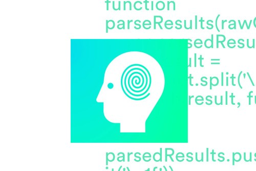

_I just rewrote our interest rate calculator. It distributes calculations across a cluster of servers. The codebase is 10 times larger but it’s sooo fast! Could I get a code review? — Scotty_

This is a fictitious email out of my bad dreams. (Yes, I dream of emails. I prefer that to dreams about debugging.) It’s not that I don’t love performance improvements or distributed systems — both are important and have their place.

But in my dream Scotty created a complex new system that will be harder to reason with and learn. I wish he hadn’t spent time on it. Good for me that this is just an example, and Scotty didn’t actually build anything like this. That’s because Scotty, and every engineer at Earnest, have a shared understanding of how we make pragmatic decisions.

Software engineers are inundated with decisions at every step of the product development process. When we were a small team I could participate in all of the important ones. Unfortunately, I don’t scale particularly well (horizontally or vertically).

As the engineering team has grown from 10 to 30 members, I’ve looked for ways to enable autonomous decision making that leads to investing our time and energy in the right things.

We’ve developed a simple framework for investment decisions based on a memorable acronym: PASSMADE. It’s a term popularized by Microsoft for their Solutions Developer certification, and is a checklist of architectural concerns to consider when building software. It’s a helpful reminder of the important non-functional concerns that must be considered in software development.

PASSMADE stands for:

**P**erformance

**A**vailability

**S**ecurity

**S**calability

**M**aintainability

**A**ccessibility

**D**eployability

**E**xtensibility

With unlimited resources, we’d invest equally — and heavily — in all of these. In the real world, we make tradeoffs. At Earnest, three principles are more important than the others: Security, Maintainability and Availability. We don’t avoid the other concerns. Having performant systems and accessible products is important. We merely prioritize these principles when making decisions. Here’s why:

**Security**: Earnest is a financial technology company using tremendous amounts of data to evaluate our clients’ financial responsibility. The privacy and security of this data is of critical importance. The lifetime relationship with our clients is built upon the trust that we will keep their data safe.

**Maintainability**: We’re building a company intended to last generations. With a time horizon that long there will be plenty of changes to our software, services and products. The flexibility to adapt to these changes is a competitive advantage enabling our long term success.

**Availability**: We’re a technology company and it’s 2015. We don’t keep banker’s hours. Our clients expect 24/7 access to services and a feature set that enables them to self-serve.

By selecting and communicating which specific principles are most important we enable everyone on the team to make similar pragmatic decisions.

That means when Connie, for example, is discussing next week’s work with her team they will decide what projects to tackle based on this framework. Should they invest in a better image compression system to make our pages load faster? Or, should they simplify the page build process to have less moving parts? Our investment preference for maintainability over performance makes the path clearer.

Prioritizing our architectural concerns has been a positive enabler for our team. The framework is embedded within our software design process allowing us to scale consistent decision making while tripling the size of the team. Unfortunately, there is one decision PASSMADE can’t help make for you.
You’re on your own with [naming things](http://martinfowler.com/bliki/TwoHardThings.html).

If you also like secure, maintainable and available software — or distributed interest rate calculators — [give us a look](https://www.meetearnest.com/careers/#/overview), we’re hiring.

---

**New to Earnest?** Earnest is a technology company using cutting-edge data science, smarter design, and software automation to rebuild financial services. Founded on the belief that financially responsible people deserve better options and access to credit, Earnest’s lending products are built for a new generation seeking to reach life’s milestones. Using a unique data-driven underwriting process, Earnest understands every applicant’s full financial story to offer the lowest possible rates and radically flexible loan options for living life.
