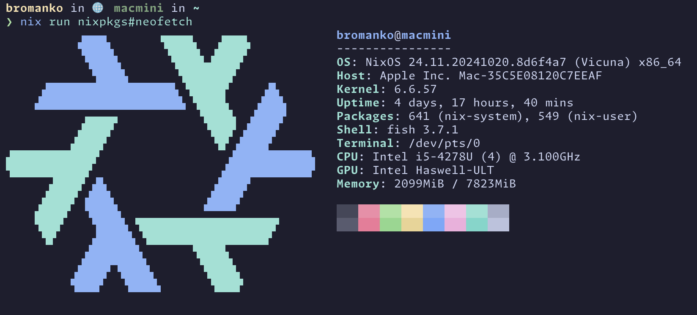

YouTube Kids is a major disappointment. Despite a recent refresh the app is buggy and devoid of basic features:
- Videos from subscribed channels doesn't appear in the app. Viewing the same channel on YouTube shows significantly more videos. 
- There's no way to navigate to subscribed channels and view all of the videos. You can only browse via an algorithmically generated feed.
- Our account is configured to only allow parent-approved content. However, the search feature often returns no results with no explanation why. 
- My partner and I are members of the same Family account however she sees different child accounts in her view than I do in mine. We seem to have created a split-brain family account that I can't figure out how to resolve. 

I spent some time over the holiday break figuring out a self-hosted alternative to YouTube Kids that has addressed all of my problems and left me with a more feature-rich alternative. The kids have branded it **DadaTube**. 
## Hardware
I have a 2014-era MacMini that hasn't gotten much use in the past few years. It's a bit dated, with a 3.1 GHz Core i5, 8 GB of RAM, and a 500 GB hard disk. But, it is holding up to two  simultaneous streams while processing subscriptions and downloading videos.

## Software
This MacMini can no longer run the latest version of macOS. So, I opted to replace it with NixOS. I wrote up some [crude instructions](https://github.com/bromanko/nix-config/tree/main/hosts/nixos/macmini) for the setup and added the [system configuration](https://github.com/bromanko/nix-config/blob/main/hosts/nixos/macmini/default.nix) to my nix-config repo. 

### Tailscale
I added the MacMini to my [Tailscale](https://tailscale.com) network. This lets me use [MagicDNS](https://tailscale.com/kb/1081/magicdns) to access the host via a friendly name. It also ensures client devices can connect to the MacMini when we're not at home. (All of our client devices already run Tailscale so that I can use our AppleTV as an exit node. This lets me use region-locked streaming services while traveling abroad.)
### Tube Archivist
The core of DataTube is [Tube Archivist](https://www.tubearchivist.com/). Tube Archivist manages YouTube subscriptions and media files. It's configured to pull in the latest 100 episodes of each subscription and deletes content after it's been watched. Unlike YouTube Kids this gets all videos in a subscription and hasn't been persnickety about finding the channels. 

Tube Archivist provides a comprehensive [docker compose](https://docs.tubearchivist.com/installation/docker-compose/) configuration that sets up all the required services. I used [compose-2-nix](https://github.com/aksiksi/compose2nix) to convert the compose file to a [nix module](https://github.com/bromanko/nix-config/blob/main/modules/linux/media-server.nix). It worked without issue.
### Jellyfin
The final piece of the equation is the [Jellyfin](https://jellyfin.org/) media server. This shares the Tube Archivist media volume and exposes the content as a library. I configured individual accounts for the kids and installed one of the myriad iOS Jellyfin clients on their iPads. 

One thing I'd like to do is add some granular parental controls. iOS Screen Time lets me set a time limit on overall use of DataTube. However, I'd like to add granular time limits to individual channels. Jellyfin has a robust plugin architecture that _should_ enable this. I plan to explore that next. 

