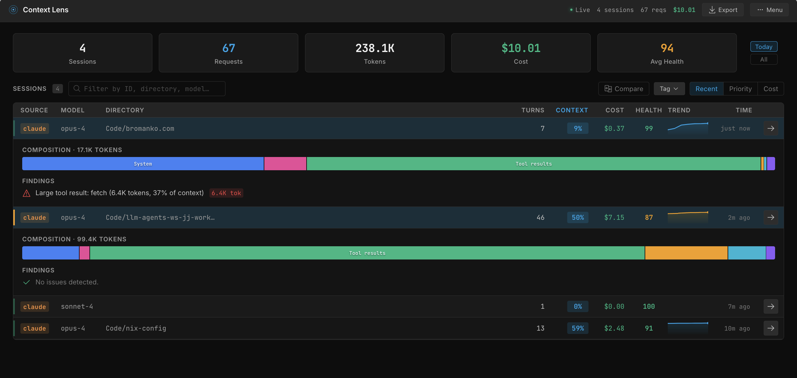
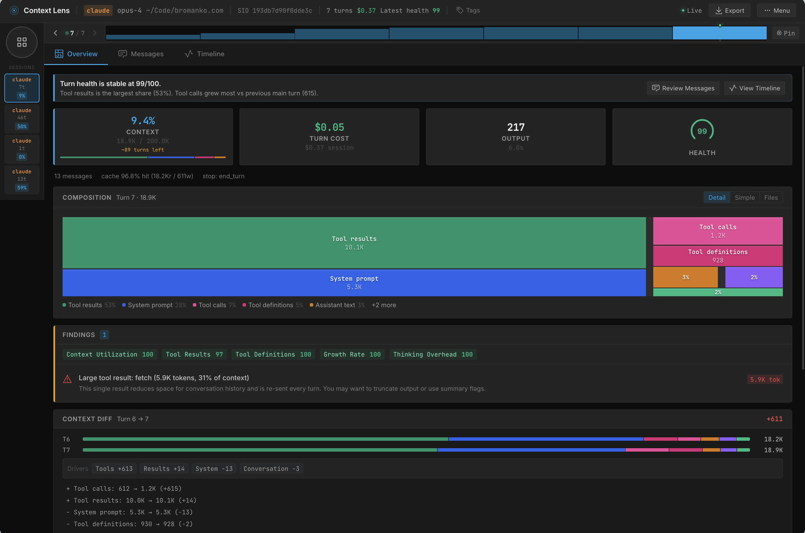
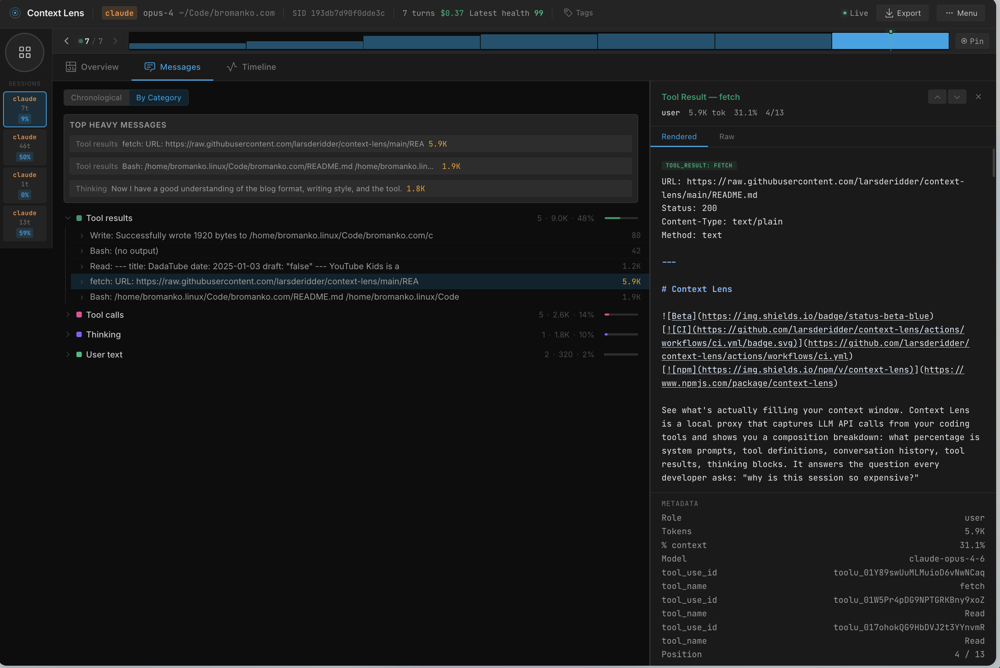

Sometimes I am surprised by how quickly I'm running through Claude session limits. Until now I had no good way to understand it.

[Context Lens](https://github.com/larsderidder/context-lens) is a local proxy that sits between your coding agent and the LLM API. It captures every request and shows you what's filling your context window — system prompts, tool definitions, conversation history, tool results, thinking blocks. No code changes. Just point your tool at the proxy and go.

I've configured it on my dev VM so all my Pi sessions route through it. Everything runs locally, which fits the [security setup I described earlier]().

Here's the session overview across my recent coding sessions:

The composition breakdown is where it gets interesting. In this session, tool calls consume 37% of the context:

Drill into those tool calls and you can see exactly which operations are expensive. One bash call alone ate 5.9K tokens — the kind of thing that was invisible to me before:

Now that I can see where the budget goes, I can make improvements to tools or restructure documentation.
